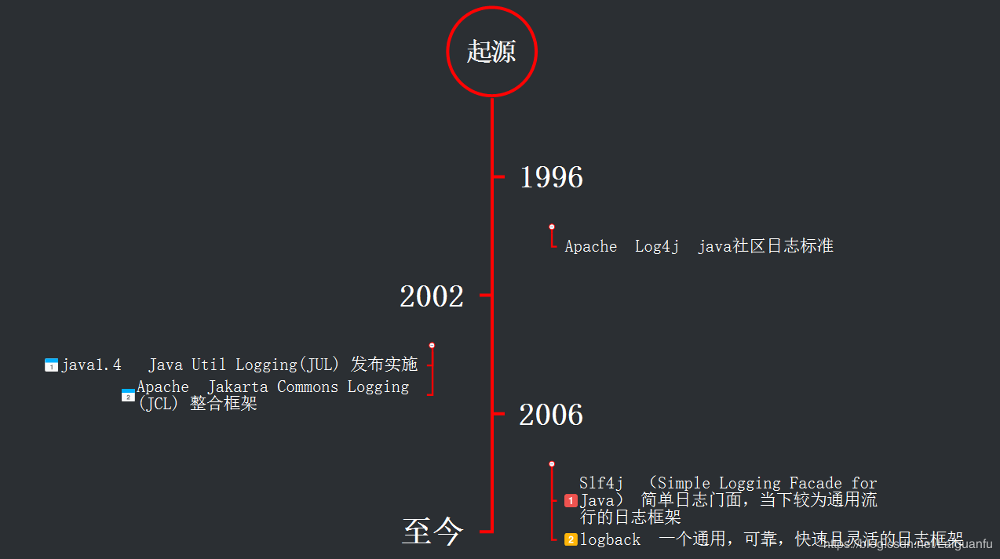
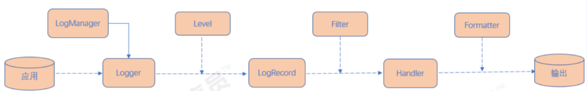
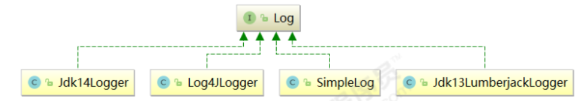
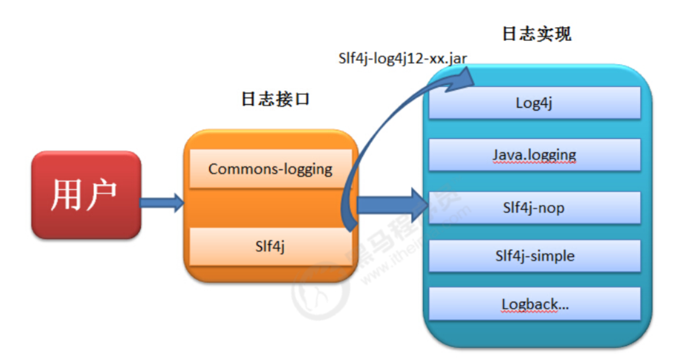
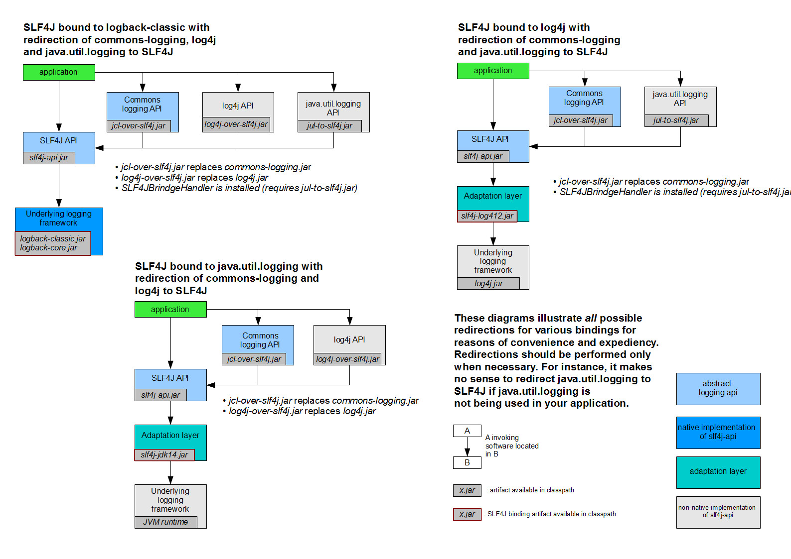
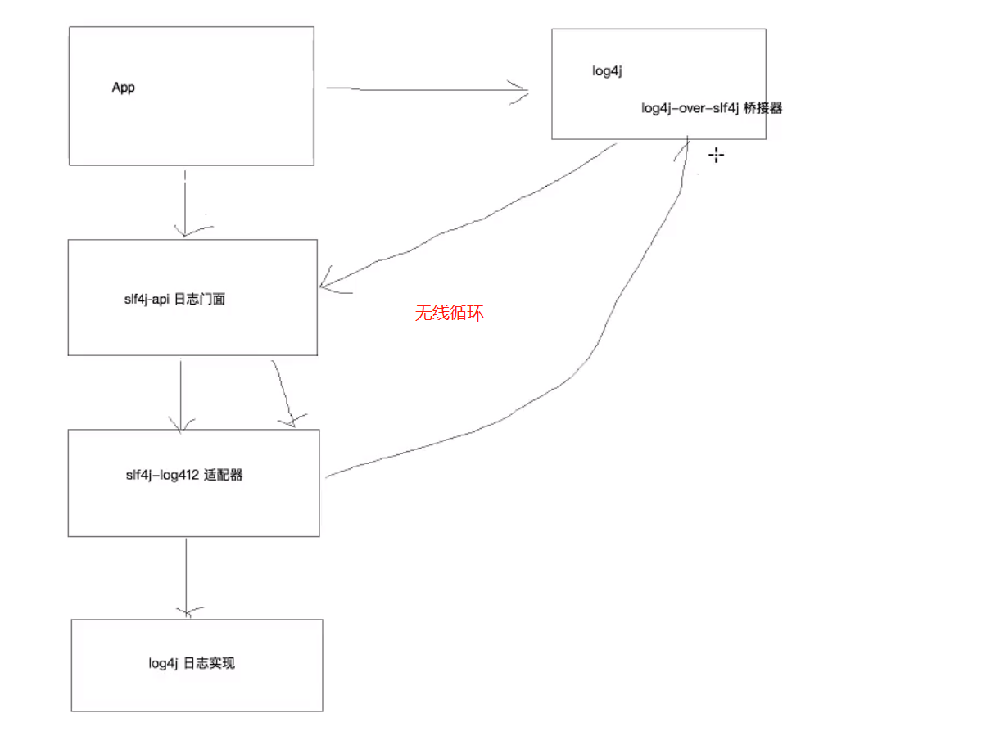

# 日志技术-目录

* [日志技术](#日志技术)
  * [1. 日志概述](#1-日志概述)
    * [1.1 基本概念](#11-基本概念)
    * [1.2 日志分类](#12-日志分类)
      * [1.2.1 调试日志](#121-调试日志)
      * [1.2.2 系统日志](#122-系统日志)
  * [2. Java日志概述](#2-java日志概述)
    * [2.1 为什么要使用日志](#21-为什么要使用日志)
    * [2.2 日志框架使用的好处](#22-日志框架使用的好处)
    * [2.3 Java日志发展简史](#23-java日志发展简史)
      * [2.3.1 发展简史](#231-发展简史)
      * [2.3.2 时间线](#232-时间线)
    * [2.3.4 发展总结](#234-发展总结)
  * [3. JUL学习（日志实现）](#3-jul学习（日志实现）)
    * [3.1 概述](#31-概述)
    * [3.2 组件介绍](#32-组件介绍)
    * [3.3 日志原理解析](#33-日志原理解析)
    * [3.4 案例解析](#34-案例解析)
    * [3.5 日志级别](#35-日志级别)
      * [3.5.1 源码探究](#351-源码探究)
      * [3.5.2 案例分析](#352-案例分析)
    * [3.6 Logger之间的父子关系](#36-logger之间的父子关系)
    * [3.7 读取自定义配置文件输出](#37-读取自定义配置文件输出)
      * [3.7.1 默认配置文件路径](#371-默认配置文件路径)
      * [3.7.2 读取自定义配置文件](#372-读取自定义配置文件)
  * [4. Log4j 学习（日志实现）](#4-log4j-学习（日志实现）)
    * [4.1 概述](#41-概述)
    * [4.2 组件介绍](#42-组件介绍)
      * [4.2.1 Loggers](#421-loggers)
      * [4.2.2 Appenders](#422-appenders)
      * [4.2.3 Layouts](#423-layouts)
    * [4.3 日志级别](#43-日志级别)
    * [4.4 案例解析](#44-案例解析)
      * [4.4.1 案例1-使用初始化配置信息](#441-案例1-使用初始化配置信息)
      * [4.4.2 案例2-使用配置文件控制台输出](#442-案例2-使用配置文件控制台输出)
      * [4.4.3 案例3-使用配置文件控制台和文件输出](#443-案例3-使用配置文件控制台和文件输出)
      * [4.4.4 案例4-不同日志级别输出到不同的位置](#444-案例4-不同日志级别输出到不同的位置)
      * [4.4.5 案例5-使用配置文件输出到数据库](#445-案例5-使用配置文件输出到数据库)
  * [5. JCL学习（日志门面）](#5-jcl学习（日志门面）)
    * [5.1 概述](#51-概述)
      * [5.1.1 为什么使用日志门面](#511-为什么使用日志门面)
    * [5.2 组件介绍](#52-组件介绍)
    * [5.3 执行原理](#53-执行原理)
    * [5.4 案例演示](#54-案例演示)
      * [5.4.1 实现1-默认使用jdk的日志](#541-实现1-默认使用jdk的日志)
      * [5.4.2 实现2-使用log4j的日志实现](#542-实现2-使用log4j的日志实现)
  * [6. Slf4j学习（日志门面）](#6-slf4j学习（日志门面）)
    * [6.1 日志门面](#61-日志门面)
    * [6.2 日志门面和日志实现的关系](#62-日志门面和日志实现的关系)
    * [6.3 slf4j概述](#63-slf4j概述)
    * [6.4 slf4j使用及案例演示](#64-slf4j使用及案例演示)
      * [6.4.1 SLF4J unbound](#641-slf4j-unbound)
      * [6.4.2 SLF4J bound to no-operation](#642-slf4j-bound-to-no-operation)
      * [6.4.3 SLF4J bound to simple](#643-slf4j-bound-to-simple)
      * [6.4.4 SLF4J bound to logback-classic](#644-slf4j-bound-to-logback-classic)
      * [6.4.5 SLF4J bound to log4j](#645-slf4j-bound-to-log4j)
      * [6.4.6 SLF4J bound to java.util.logging](#646-slf4j-bound-to-javautillogging)
    * [6.5 执行原理](#65-执行原理)
    * [6.6 日志升级-桥接器](#66-日志升级-桥接器)
      * [6.6.1 log4j升级成slf4j+logback](#661-log4j升级成slf4jlogback)
      * [6.6.2 使用注意事项](#662-使用注意事项)
  * [7. logback学习（日志实现）](#7-logback学习（日志实现）)
    * [7.1 概述](#71-概述)
  * [7.2 组件介绍](#72-组件介绍)
  * [7.3 案例解析](#73-案例解析)


# 日志技术

## 1. 日志概述

### 1.1 基本概念

所谓日志（Log）是指系统所指定对象的某些操作和其操作结果按时间有序的集合。每个日志文件由日志记录组成，每条日志记录描述了一次单独的系统事件。通常情况下，系统日志是用户可以直接阅读的文本文件，其中包含了一个[时间戳](https://baike.baidu.com/item/时间戳)和一个信息或者子系统所特有的其他信息。

日志文件为服务器、[工作站](https://baike.baidu.com/item/工作站)、防火墙和应用软件等IT资源相关活动记录必要的、有价值的信息，这对系统[监控](https://baike.baidu.com/item/监控)、查询、报表和[安全审计](https://baike.baidu.com/item/安全审计)是十分重要的。日志文件中的记录可提供以下用途：监控系统资源；审计用户行为；对可疑行为进行告警；确定入侵行为的范围；为恢复系统提供帮助；生成调查报告；为打击计算机犯罪提供证据来源。

### 1.2 日志分类

#### 1.2.1 调试日志

软件开发中，我们经常需要去调试程序，做一些信息，状态的输出便于我们查询程序的运行状况。为了让我们能够更加灵活和方便的控制这些调试的信息，所有我们需要专业的日志技术。java中寻找bug会需要重现。调试也就是debug 可以在程序运行中暂停程序运行，可以查看程序在运行中的情况。日志主要是为了更方便的去重现问题  。

#### 1.2.2 系统日志

系统日志是记录系统中硬件、软件和系统问题的信息，同时还可以监视系统中发生的事件。用户可以通过它来检查错误发生的原因，或者寻找受到攻击时攻击者留下的痕迹。系统日志包括系统日志、应用程序日志和安全日志。  

系统日志策略可以在故障刚刚发生时就向你发送警告信息，系统日志帮助你在最短的时间内发现问题。系统日志是一种非常关键的组件，因为系统日志可以让你充分了解自己的环境。这种系统日志信息对于决定故障的根本原因或者缩小系统攻击范围来说是非常关键的，因为系统日志可以让你了解故障或者袭击发生之前的所有事件。为虚拟化环境制定一套良好的系统日志策略也是至关重要的，因为系统日志需要和许多不同的外部组件进行关联。良好的系统日志可以防止你从错误的角度分析问题，避免浪费宝贵的排错时间。另外一种原因是借助于系统日志，管理员很有可能会发现一些之前从未意识到的问题，在几乎所有刚刚部署系统日志的环境当中。  

## 2. Java日志概述

### 2.1 为什么要使用日志

**在应用程序中添加日志记录总的来说基于三个目的： 监视代码中变量的变化情况，周期性的记录到文件中供其他应用进行统计分析工作； 跟踪代码运行时轨迹，作为日后审计的依据； 担当集成开发环境中的调试器的作用，向文件或控制台打印代码的调试信息**

### 2.2 日志框架使用的好处

软件系统发展到今天已经很复杂了，特别是服务器端软件，涉及到的知识，内容，问题太多。在某些方面使用别人成熟的框架，就相当于让别人帮你完成一些基础工作，你只需要集中精力完成系统的业务逻辑设计。而且框架一般是成熟，稳健的，他可以处理系统很多细节问题，比如，事务处理，安全性，数据流控制等问题。还有框架一般都经过很多人使用，所以结构很好，所以扩展性也很好，而且它是不断升级的，你可以直接享受别人升级代码带来的好处。  

### 2.3 Java日志发展简史

#### 2.3.1 发展简史

- **1996年早期，**欧洲安全电子市场项目组决定编写它自己的程序跟踪API(Tracing API)。经过不断的完善，这个API终于成为一个十分受欢迎的Java日志软件包，即**Log4j**。后来Log4j成为Apache基金会项目中的一员。

- 期间Log4j近乎成了Java社区的日志标准。据说Apache基金会还曾经建议Sun引入Log4j到java的标准库中，但Sun拒绝了。

- **2002年Java1.4**发布，Sun推出了自己的日志库**JUL(Java Util Logging)**,其实现基本模仿了Log4j的实现。在JUL出来以前，Log4j就已经成为一项成熟的技术，使得Log4j在选择上占据了一定的优势。

- 接着，Apache推出了**Jakarta Commons Logging**，即**JCL**只是定义了一套日志接口(其内部也提供一个Simple  Log的简单实现)，支持运行时动态加载日志组件的实现，也就是说，在你应用代码里，**只需调用Commons  Logging的接口，底层实现可以是Log4j，也可以是Java Util Logging**。

- 后来(**2006年**)，Ceki  Gülcü不适应Apache的工作方式，离开了Apache。然后先后创建了**Slf4j（Simple Logging Facade for Java  ）**(日志门面接口，类似于Commons  Logging)和**Logback**(Slf4j的实现)两个项目，并回瑞典创建了QOS公司，QOS官网上是这样描述Logback的：The  Generic，Reliable Fast&Flexible Logging  Framework(一个通用，可靠，快速且灵活的日志框架)。

- 现今，Java日志领域被划分为两大阵营：Commons Logging阵营和Slf4j阵营。Commons Logging在Apache大树的笼罩下，有很大的用户基数。但有证据表明，形式正在发生变化。2013年底有人分析了GitHub上30000个项目，统计出了最流行的100个Libraries，可以看出Slf4j的发展趋势更好：
  


- Apache眼看有被Logback反超的势头，于**2012-07**重写了Log4j 1.x，成立了新的项目**Log4j 2**, Log4j 2具有Logback的所有特性。

#### 2.3.2 时间线

日志框架出现的历史顺序：log4j -->JUL-->JCL--> slf4j --> logback --> log4j2  



### 2.3.4 发展总结

- 日志门面：一般采取facade设计模式（*外观设计模式*：*外观模式定义了一个高层的功能，为子系统中的多个模块协同的完成某种功能需求提供简单的对外功能调用方式，使得这一子系统更加容易被外部使用*）设计的一组接口应用。比如：**JCL（Jakarta Commons Logging）、slf4j（ Simple Logging Facade for Java）**  。

- 日志实现：接口的实现.比如：**JUL、logback、log4j、log4j2**  。

  |                 日志门面                 | 日志实现 |
  | :--------------------------------------: | :------: |
  |      JCL（Jakarta Commons Logging）      |   JUL    |
  |                                          |  log4j   |
  | slf4j（ Simple Logging Facade for Java） | logback  |
  |                                          |  log4j2  |

- 比较常用的组合使用方式是Slf4j与Logback组合使用，Commons Logging与Log4j组合使用。

- Logback必须配合Slf4j使用。由于Logback和Slf4j是同一个作者，其兼容性不言而喻。

## 3. JUL学习（日志实现）

### 3.1 概述

JUL全称Java util Logging是java原生的日志框架（`java.util.logging`包下），使用时不需要另外引用第三方类库，相对其他日志框架使用方便，学习简单，能够在小型应用中灵活使用。  

### 3.2 组件介绍

- Loggers：被称为记录器，应用程序通过获取Logger对象，调用其API来来发布日志信息。Logger
  通常时应用程序访问日志系统的入口程序。
- Appenders：也被称为Handlers，每个Logger都会关联一组Handlers，Logger会将日志交给关联
  Handlers处理，由Handlers负责将日志做记录。Handlers在此是一个抽象，其具体的实现决定了
  日志记录的位置可以是控制台、文件、网络上的其他日志服务或操作系统日志等。
- Layouts：也被称为Formatters，它负责对日志事件中的数据进行转换和格式化。Layouts决定了
  数据在一条日志记录中的最终形式。
- Level：每条日志消息都有一个关联的日志级别。该级别粗略指导了日志消息的重要性和紧迫，我
  可以将Level和Loggers，Appenders做关联以便于我们过滤消息。
- Filters：过滤器，根据需要定制哪些信息会被记录，哪些信息会被放过。  
- 总结：用户使用Logger来进行日志记录，Logger持有若干个Handler，日志的输出操作是由Handler完成的。
  在Handler在输出日志前，会经过Filter的过滤，判断哪些日志级别过滤放行哪些拦截，Handler会将日
  志内容输出到指定位置（日志文件、控制台等）。Handler在输出日志时会使用Layout，将输出内容进
  行排版。  

### 3.3 日志原理解析

1. 初始化LogManager
   1.1 LogManager加载logging.properties配置
   1.2. 添加Logger到LogManager

2. 从单例LogManager获取Logger

3. 设置级别Level，并指定日志记录LogRecord

4. Filter提供了日志级别之外更细粒度的控制

5. Handler是用来处理日志输出位置

6. Formatter是用来格式化LogRecord的  

   

### 3.4 案例解析

[更详细的内容请参考项目](./jul-log/src/main/java/cn/yhs/learn/test/JULTest.java)

```java
package cn.yhs.learn.test;

import java.io.IOException;
import java.io.InputStream;
import java.util.logging.*;
import org.junit.Test;

public class JULTest {
    // todo 1 快速入门
    @Test
    public void test() {
        // 1. 创建日志对象
        Logger logger = Logger.getLogger(this.getClass().getName());
        System.out.println("我是日志信息");
        // 2. 日志记录输出
        logger.info("我是日志信息");// 日志信息是红颜色的
        // 3. 通用方法日志记录输出
        logger.log(Level.INFO, "我是info级别。。。");
        // 4. 还可以通过占位符方式来输出变量
        Object name = "喻汉生";
        Object age = 18;
        logger.log(Level.INFO, "用户信息：{0}，{1}", new Object[]{name, age});
    }
    // todo 4 输出文件对象
    @Test
    public void test4() {
        // 1. 创建日志对象
        Logger logger = Logger.getLogger(this.getClass().getName());
        // 2.0 关闭系统设置
        logger.setUseParentHandlers(false);
        // 2.1 创建日志文件处理器
        FileHandler fileHandler = null;
        try {
            // 注意：会自动创建文件，但是不会创建目录
            fileHandler = new FileHandler("d:/log/jul.log");
        } catch (IOException e) {
            e.printStackTrace();
        }
        // 2.2 创建输出格式对象
        SimpleFormatter simpleFormatter = new SimpleFormatter();
        // 2.3 将输出格式对象和输出对象关联
        fileHandler.setFormatter(simpleFormatter);
        // 2.4 将输出对象和日志对象关联
        logger.addHandler(fileHandler);
        // 2.5 设置日志级别
        logger.setLevel(Level.ALL); // 设置根日志的级别
        fileHandler.setLevel(Level.ALL);
        // 3. 日志输出
        logger.severe("severe");
        logger.warning("warning");
        logger.info("info");
        logger.config("config");
        logger.fine("fine");
        logger.finer("finer");
        logger.finest("finest");
    }
```

### 3.5 日志级别

#### 3.5.1 源码探究

```java
package java.util.logging; 
/**
 *  1. java.util.logging.Level 定义了7种日志级别,7个日志级别但是默认只实现info以上的级别
 * public boolean isLoggable(Level level) {
 * if (level.intValue() < levelValue || levelValue == offValue) {
 * return false; // 2. 该方法说明只会输出当前级别和比自己级别高的日志信息
 * }
 * return true;
 * }
 * 
 * SEVERE (highest value)
 * WARNING
 * INFO
 * CONFIG
 * FINE
 * FINER
 * FINEST  (lowest value)
 * @since 1.4
 */
public class Level implements java.io.Serializable {
    // 关闭所有级别日志
    public static final Level OFF = new Level("OFF",Integer.MAX_VALUE, defaultBundle);
    public static final Level SEVERE = new Level("SEVERE",1000, defaultBundle);
    public static final Level WARNING = new Level("WARNING", 900, defaultBundle);
    public static final Level INFO = new Level("INFO", 800, defaultBundle);
    public static final Level CONFIG = new Level("CONFIG", 700, defaultBundle);
    public static final Level FINE = new Level("FINE", 500, defaultBundle);
    public static final Level FINER = new Level("FINER", 400, defaultBundle);
    public static final Level FINEST = new Level("FINEST", 300, defaultBundle);
    // 打开所有级别日志
    public static final Level ALL = new Level("ALL", Integer.MIN_VALUE, defaultBundle);
 //  ...
}
```

#### 3.5.2 案例分析

```java
  // todo 2 日志级别
    @Test
    public void test2() {
        // 1. 获取日志对象
        Logger logger = Logger.getLogger(this.getClass().getName());
        //        logger.setLevel(Level.OFF); // 关闭日志输出
        //        logger.setLevel(Level.ALL); // 开启日志输出

        // 2. 日志级别输出，实际是哪个都是在调用通用log(Level.SEVERE, msg);
        logger.severe("severe");
        logger.warning("warning");
        logger.info("info"); // JUL 默认是info级别,会输出info及以上级别的日志信息
        logger.config("config");
        logger.fine("fine");
        logger.finer("finer");
        logger.finest("finest");
    }


    // todo 3 自定义日志级别并输出到控制台
    @Test
    public void test3() {
        // 1. 创建日志记录对象，构造器私有化，使用提供的静态方法
        Logger logger = Logger.getLogger(this.getClass().getName());
        // 2.0 关闭系统默认设置
        logger.setUseParentHandlers(false);
        // 2.1 创建控制台输出对象
        ConsoleHandler consoleHandler = new ConsoleHandler();
        // 2.2 创建输出格式
        SimpleFormatter simpleFormatter = new SimpleFormatter();
        // 2.3 将输出格式和控制台想关联
        consoleHandler.setFormatter(simpleFormatter);
        // 2.4 将控制台和当前日志对象进行想管理
        logger.addHandler(consoleHandler);
        // 2.5 设置日志级别，consoleHandler的默认级别是info
        consoleHandler.setLevel(Level.ALL);
        logger.setLevel(Level.ALL);
        // 3. 输出日志
        logger.severe("severe");
        logger.warning("warning");
        logger.info("info");
        logger.config("config");
        logger.fine("fine");
        logger.finer("finer");
        logger.finest("finest");

    }
```

### 3.6 Logger之间的父子关系

```java
  // todo 5 测试父子关系
    @Test
    public void test5() {
        Logger logger1 = Logger.getLogger("cn.yhs.learn");
        Logger logger2 = Logger.getLogger("cn.yhs");
        Logger logger3 = Logger.getLogger("cn");
        System.out.println("logger1 = " + logger1);//logger1 = java.util.logging.Logger@50134894
        System.out.println("logger2 = " + logger2);//logger2 = java.util.logging.Logger@2957fcb0
        System.out.println("logger3 = " + logger3);//logger3 = java.util.logging.Logger@1376c05c
        Logger logger1Parent = logger1.getParent();
        Logger logger2Parent = logger2.getParent();
        Logger logger3Parent = logger3.getParent();
        System.out.println("logger1Parent = " + logger1Parent);//logger1Parent = java.util.logging.Logger@2957fcb0
        System.out.println("logger2Parent = " + logger2Parent);//logger2Parent = java.util.logging.Logger@1376c05c
        System.out.println("logger3Parent = " + logger3Parent);//logger3Parent = java.util.logging.LogManager$RootLogger@51521cc1
        // 自定义设置logger2的日志级别,测试父子关系
        logger2.setUseParentHandlers(false);
        ConsoleHandler consoleHandler = new ConsoleHandler();
        SimpleFormatter simpleFormatter = new SimpleFormatter();
        consoleHandler.setFormatter(simpleFormatter);
        logger2.addHandler(consoleHandler);
        consoleHandler.setLevel(Level.ALL);
        logger2.setLevel(Level.ALL);

        System.out.println("logger1 的日志输出");
        logger1.severe("severe");
        logger1.warning("warning");
        logger1.info("info");
        logger1.config("config");
        logger1.fine("fine");
        logger1.finer("finer");
        logger1.finest("finest");

        System.out.println("logger2 的日志输出");
        logger2.severe("severe");
        logger2.warning("warning");
        logger2.info("info");
        logger2.config("config");
        logger2.fine("fine");
        logger2.finer("finer");
        logger2.finest("finest");

        System.out.println("logger3 的日志输出");
        logger3.severe("severe");
        logger3.warning("warning");
        logger3.info("info");// 只会输出INFO及以上级别
        logger3.config("config");
        logger3.fine("fine");
        logger3.finer("finer");
        logger3.finest("finest");
        /**
         * 结论：
         * ① 日子之间是存在父子关系的，按照java中的包级别来进行划分，最顶级包的父类是LogManager$RootLogger
         * ② 由于logger2自定义设置了日志输出级别，所以loggeer2及其子类（logger1）会输出指定级别的日志，而logger3是logger2的父类，由于
         * 没有设置日志级别，默认是INFO。
         */
    }
```

### 3.7 读取自定义配置文件输出

#### 3.7.1 默认配置文件路径 

$JAVAHOME\jre\lib\logging.properties  

#### 3.7.2 读取自定义配置文件

配置文件

```java
 // todo 加载自定义日志文件，配置日志级别和输出格式
    @Test
    public void test6() throws IOException {
        // 1.读取配置文件
        InputStream inputStream = this.getClass().getClassLoader().getResourceAsStream("logging.properties");
        // 2. 获取日志管理器对象,单例的
        LogManager logManager = LogManager.getLogManager();
        // 3. 通过日志管理器对象加载配置文件
        logManager.readConfiguration(inputStream);
        // 4. 打印日志
        Logger logger = Logger.getLogger(this.getClass().getName());
        logger.severe("severe");
        logger.warning("warning");
        logger.info("info"); // JUL 默认是info级别,会输出info及以上级别的日志信息
        logger.config("config");
        logger.fine("fine");
        logger.finer("finer");
        logger.finest("finest");
    }

    @Test
    public void test7() throws IOException {
        /**
         * # 自定义日志格式
         * #cn.yhs.learn.test.handlers = java.util.logging.ConsoleHandler
         * #cn.yhs.learn.test.level = CONFIG
         * #cn.yhs.learn.test.useParentHandlers = false
         */
        // 1.读取配置文件
        InputStream inputStream = this.getClass().getClassLoader().getResourceAsStream("logging.properties");
        // 2. 获取日志管理器对象,单例的
        LogManager logManager = LogManager.getLogManager();
        // 3. 通过日志管理器对象加载配置文件
        logManager.readConfiguration(inputStream);
        // 4. 打印日志
//        Logger logger = Logger.getLogger(this.getClass().getName());
        Logger logger = Logger.getLogger("cn.yhs.learn.test");
        logger.severe("severe");
        logger.warning("warning");
        logger.info("info");
        logger.config("config");
        logger.fine("fine");
        logger.finer("finer");
        logger.finest("finest");
    }
}
```

## 4. Log4j 学习（日志实现）

### 4.1 概述

官网：http://logging.apache.org/log4j/1.2/

Log4j是Apache下的一款开源的日志框架，通过在项目中使用 Log4J，我们可以控制日志信息输出到控制台、文件、甚至是数据库中。我们可以控制每一条日志的输出格式，通过定义日志的输出级别，可以更灵活的控制日志的输出过程。方便项目的调试。  

### 4.2 组件介绍

Log4J 主要由 Loggers (日志记录器)、Appenders（输出端）和 Layout（日志格式化器）组成。其中Loggers 控制日志的输出级别与日志是否输出；Appenders 指定日志的输出方式（输出到控制台、文件等）；Layout 控制日志信息的输出格式。  

#### 4.2.1 Loggers

日志记录器，负责收集处理日志记录，实例的命名就是类“XX”的full quailied name（类的全限定名），Logger的名字大小写敏感，其命名有继承机制：例如：name为org.apache.commons的logger会继承name为org.apache的logger。Log4J中有一个特殊的logger叫做“root”，他是所有logger的根，也就意味着其他所有的logger都会直接间接地继承自root。root logger可以用Logger.getRootLogger()方法获取。但是，自log4j 1.2版以来， Logger 类已经取代了 Category 类。对于熟悉早期版本的log4j的人来说，Logger 类可以被视为 Category 类的别名。  

#### 4.2.2 Appenders

Appender 用来指定日志输出到哪个地方，可以同时指定日志的输出目的地。Log4j 常用的输出目的地有以下几种：

| **输出端类型**           | **作用**                                                     |
| ------------------------ | ------------------------------------------------------------ |
| ConsoleAppender          | 将日志输出到控制台                                           |
| FileAppender             | 将日志输出到文件中                                           |
| DailyRollingFileAppender | 将日志输出到一个日志文件，并且每天输出到一个新的文件         |
| RollingFileAppender      | 将日志信息输出到一个日志文件，并且指定文件的尺寸，当文件大 小达到指定尺寸时，会自动把文件改名，同时产生一个新的文件 |
| JDBCAppender             | 把日志信息保存到数据库中                                     |

#### 4.2.3 Layouts

布局器 Layouts用于控制日志输出内容的格式，让我们可以使用各种需要的格式输出日志。Log4j常用的Layouts:  

| 格式化器类型  | 作用                                                         |
| ------------- | ------------------------------------------------------------ |
| HTMLLayout    | 格式化日志输出为HTML表格形式                                 |
| SimpleLayout  | 简单的日志输出格式化，打印的日志格式为（info - message）     |
| PatternLayout | 最强大的格式化期，可以根据自定义格式输出日志，如果没有指定转换格式， 就是用默认的转换格式 |

```java
/*
    # 在log4j.properties  配置文件中，定义输出格式
    # log4j 采用类似 C 语言的 printf 函数的打印格式格式化日志信息，具体的占位符及其含义如下：
    %m 输出代码中指定的日志信息
    %p 输出优先级，及 DEBUG、INFO 等
    %n 换行符（Windows平台的换行符为 "\n"，Unix 平台为 "\n"）
    %r 输出自应用启动到输出该 log 信息耗费的毫秒数
    %c 输出打印语句所属的类的全名
    %t 输出产生该日志的线程全名
    %d 输出服务器当前时间，默认为 ISO8601，也可以指定格式，如：%d{yyyy年MM月dd日HH:mm:ss}
    %l 输出日志时间发生的位置，包括类名、线程、及在代码中的行数。如：Test.main(Test.java:10)
    %F 输出日志消息产生时所在的文件名称
    %L 输出代码中的行号
    %% 输出一个 "%" 字符
    # 可以在 % 与字符之间加上修饰符来控制最小宽度、最大宽度和文本的对其方式。如：
    %5c 输出category名称，最小宽度是5，category<5，默认的情况下右对齐
    %-5c 输出category名称，最小宽度是5，category<5，"-"号指定左对齐,会有空格
    %.5c 输出category名称，最大宽度是5，category>5，就会将左边多出的字符截掉，<5不会有空格
    %20.30c category名称<20补空格，并且右对齐，>30字符，就从左边交远销出的字符截掉
*/
```

### 4.3 日志级别

```java
/*
*每个Logger都被了一个日志级别（log level），用来控制日志信息的输出。日志级别从高到低分为：
    fatal 指出每个严重的错误事件将会导致应用程序的退出。
    error 指出虽然发生错误事件，但仍然不影响系统的继续运行。
    warn 表明会出现潜在的错误情形。
    info 一般和在粗粒度级别上，强调应用程序的运行全程。
    debug 一般用于细粒度级别上，对调试应用程序非常有帮助。
    trace 是程序追踪，可以用于输出程序运行中的变量，显示执行的流程。
* 还有两个特殊的级别：
    OFF，可用来关闭日志记录。
    ALL，启用所有消息的日志记录。
注：一般只使用4个级别，优先级从高到低为 ERROR > WARN > INFO > DEBUG
*/
```

### 4.4 案例解析

#### 4.4.1 案例1-使用初始化配置信息

```xml
<!--1.导入log4j的依赖 -->
		<dependency>
            <groupId>log4j</groupId>
            <artifactId>log4j</artifactId>
            <version>1.2.17</version>
        </dependency>
```

```java
    // todo log4j 入门案例,使用初始化配置信息
    @Test
    public void test() {
        /**
         * log4j:WARN No appenders could be found for logger (cn.yhs.learn.test.Log4JTest).
         * log4j:WARN Please initialize the log4j system properly.
         * log4j:WARN See http://logging.apache.org/log4j/1.2/faq.html#noconfig for more info.
         */
        // 0. 初始化配置信息,(没有使用配置文件log4j.properties)，不然不会打印信息，会提示进行配置
       BasicConfigurator.configure();
        /**
         * log4j: Trying to find [log4j.xml] using context classloader sun.misc.Launcher$AppClassLoader@18b4aac2.
         * log4j: Trying to find [log4j.xml] using sun.misc.Launcher$AppClassLoader@18b4aac2 class loader.
         * log4j: Trying to find [log4j.xml] using ClassLoader.getSystemResource().
         * log4j: Trying to find [log4j.properties] using context classloader sun.misc.Launcher$AppClassLoader@18b4aac2.
         * log4j: Trying to find [log4j.properties] using sun.misc.Launcher$AppClassLoader@18b4aac2 class loader.
         * log4j: Trying to find [log4j.properties] using ClassLoader.getSystemResource().
         * log4j: Could not find resource: [null].
         */
        // 开启 log4j 内置的日志记录
        LogLog.setInternalDebugging(true);

        // 1. 获取日志对象
        Logger logger = Logger.getLogger(this.getClass());
        // 2. 日志记录输出
        logger.fatal("fatal");
        logger.error("error");
        logger.warn("warn");
        logger.info("info");
        logger.debug("debug");// 默认的debug级别，会打印debug及以上级别的信息
        logger.trace("trace");
    }
```

#### 4.4.2 案例2-使用配置文件控制台输出

1. log4j.properties文件

```properties
log4j.rootLogger=trace,console
# 配置输出端对象
log4j.appender.console=org.apache.log4j.ConsoleAppender
# 配置输出对象的输出格式
log4j.appender.console.layout=org.apache.log4j.PatternLayout
# 配置自定义输出格式
# log4j.appender.console.layout.conversionPattern=%r [%t] %p %c %x - %m%n
log4j.appender.console.layout.conversionPattern=%r [%t] [%p] %l  - %m%n
```

```java
    @Test // 使用配置文件控制台输出
    public void test2() {
        // 0. 开启 log4j 内置的日志记录
        LogLog.setInternalDebugging(true);
        // 1. 获取日志对象
        Logger logger = Logger.getLogger(this.getClass());
        // 2. 日志记录输出
        logger.fatal("fatal");
        logger.error("error");
        logger.warn("warn");
        logger.info("info");
        logger.debug("debug");// 默认的debug级别
        logger.trace("trace");
    }
/* 结果分析
log4j: Trying to find [log4j.xml] using context classloader sun.misc.Launcher$AppClassLoader@18b4aac2.
log4j: Trying to find [log4j.xml] using sun.misc.Launcher$AppClassLoader@18b4aac2 class loader.
log4j: Trying to find [log4j.xml] using ClassLoader.getSystemResource().
log4j: Trying to find [log4j.properties] using context classloader sun.misc.Launcher$AppClassLoader@18b4aac2.
log4j: Using URL [file:/C:/Users/1/IdeaProjects/java-log/log4j-log/target/classes/log4j.properties] for automatic log4j configuration.
log4j: Reading configuration from URL file:/C:/Users/1/IdeaProjects/java-log/log4j-log/target/classes/log4j.properties
log4j: Parsing for [root] with value=[trace,console].
log4j: Level token is [trace].
log4j: Category root set to TRACE
log4j: Parsing appender named "console".
log4j: Parsing layout options for "console".
log4j: Setting property [conversionPattern] to [%r [%t] [%p] %l  - %m%n].
log4j: End of parsing for "console".
log4j: Parsed "console" options.
log4j: Finished configuring.
0 [main] [FATAL] cn.yhs.learn.test.Log4JTest.test2(Log4JTest.java:73)  - fatal
2 [main] [ERROR] cn.yhs.learn.test.Log4JTest.test2(Log4JTest.java:74)  - error
2 [main] [WARN] cn.yhs.learn.test.Log4JTest.test2(Log4JTest.java:75)  - warn
3 [main] [INFO] cn.yhs.learn.test.Log4JTest.test2(Log4JTest.java:76)  - info
3 [main] [DEBUG] cn.yhs.learn.test.Log4JTest.test2(Log4JTest.java:77)  - debug
3 [main] [TRACE] cn.yhs.learn.test.Log4JTest.test2(Log4JTest.java:78)  - trace
*/
```

#### 4.4.3 案例3-使用配置文件控制台和文件输出

1. log4j.properties

```properties
log4j.rootLogger=trace,console,F
# 配置输出端对象控制台
log4j.appender.console=org.apache.log4j.ConsoleAppender
# 配置输出对象的输出格式
log4j.appender.console.layout=org.apache.log4j.PatternLayout
# 配置自定义输出格式
# log4j.appender.console.layout.conversionPattern=%r [%t] %p %c %x - %m%n
# log4j.appender.console.layout.conversionPattern=%r [%t] [%p] %l  - %m%n
log4j.appender.console.layout.conversionPattern=%d [%t] [%-10p] [%c] - %m%n
# 配置文件输出 - 按照天数滚动
log4j.appender.F=org.apache.log4j.DailyRollingFileAppender
# 指定文件的输出路径
log4j.appender.F.File=d://log/daily-log.log
# 开启文件追加的方式
log4j.appender.F.Append=true
#使用自定义日志格式化器
log4j.appender.F.layout = org.apache.log4j.PatternLayout
#指定日志的输出格式
log4j.appender.F.layout.ConversionPattern = %-d{yyyy-MM-dd HH:mm:ss} [%t:%r] -[%p] %m%n
#指定日志的文件编码
log4j.appender.F.encoding=UTF-8
```

#### 4.4.4 案例4-不同日志级别输出到不同的位置

```properties
log4j.rootLogger=DEBUG, INFO, ERROR
# 输出控制台
log4j.appender.CONSOLE=org.apache.log4j.ConsoleAppender
log4j.appender.CONSOLE.Threshold=INFO
log4j.appender.CONSOLE.Target=System.out
log4j.appender.CONSOLE.Encoding=UTF-8
log4j.appender.CONSOLE.layout=org.apache.log4j.PatternLayout
log4j.appender.CONSOLE.layout.ConversionPattern=[%p]%d{yyyy-MM-dd HH:mm:ss} %l -  %m%n

### 输出INFO及以上级别到日志文件 ###
log4j.appender.INFO = org.apache.log4j.DailyRollingFileAppender
log4j.appender.INFO.File = /data/log/messagePush/messagePush_info.log
log4j.appender.INFO.File = D://log/messagePush_info.log
log4j.appender.INFO.Append = true
log4j.appender.INFO.Threshold = INFO
log4j.appender.INFO.Encoding=UTF-8
log4j.appender.INFO.layout = org.apache.log4j.PatternLayout
log4j.appender.INFO.layout.ConversionPattern = [%p] %d{yyyy-MM-dd HH:mm:ss} %l - %m%n

### 输出ERROR到日志文件 ###
log4j.appender.ERROR = org.apache.log4j.DailyRollingFileAppender
log4j.appender.ERROR.File = /data/log/messagePush/messagePush_error.log
log4j.appender.ERROR.File = D://log/messagePush_error.log
log4j.appender.ERROR.Append = true
log4j.appender.ERROR.Threshold = ERROR
log4j.appender.ERROR.Encoding=UTF-8
log4j.appender.ERROR.layout = org.apache.log4j.PatternLayout
log4j.appender.ERROR.layout.ConversionPattern = [%p] %d{yyyy-MM-dd HH:mm:ss} %l - %m%n
```

#### 4.4.5 案例5-使用配置文件输出到数据库

```sql
CREATE TABLE `log` (
    `log_id` int(11) NOT NULL AUTO_INCREMENT,
    `project_name` varchar(255) DEFAULT NULL COMMENT '目项名',
    `create_date` varchar(255) DEFAULT NULL COMMENT '创建时间',
    `level` varchar(255) DEFAULT NULL COMMENT '优先级',
    `category` varchar(255) DEFAULT NULL COMMENT '所在类的全名',
    `file_name` varchar(255) DEFAULT NULL COMMENT '输出日志消息产生时所在的文件名称 ',
    `thread_name` varchar(255) DEFAULT NULL COMMENT '日志事件的线程名',
    `line` varchar(255) DEFAULT NULL COMMENT '号行',
    `all_category` varchar(255) DEFAULT NULL COMMENT '日志事件的发生位置',
    `message` varchar(4000) DEFAULT NULL COMMENT '输出代码中指定的消息',
    PRIMARY KEY (`log_id`)
);
```

```properties
log4j.rootLogger = ALL,logDB
#mysql
log4j.appender.logDB=org.apache.log4j.jdbc.JDBCAppender
log4j.appender.logDB.layout=org.apache.log4j.PatternLayout
log4j.appender.logDB.Driver=com.mysql.jdbc.Driver
log4j.appender.logDB.URL=jdbc:mysql://localhost:3306/dm
log4j.appender.logDB.User=root
log4j.appender.logDB.Password=123456
log4j.appender.logDB.Sql=INSERT INTO log(project_name,create_date,level,category,file_name,thread_name,line,all_category,message) values('itcast','%d{yyyy-MM-dd HH:mm:ss}','%p','%c','%F','%t','%L','%l','%m')
```

```java
 @Test // 使用配置文件输出到数据库
    public void test3() {
        // 0. 开启 log4j 内置的日志记录
         LogLog.setInternalDebugging(true);
        // 1. 获取日志对象
        Logger logger = Logger.getLogger(this.getClass());

        // 2. 日志记录输出
        for (int i = 0; i < 100; i++) {
            logger.fatal("fatal" + i);
            logger.error("error" + i);
            logger.warn("warn" + i);
            logger.info("info" + i);
            logger.debug("debug" + i);// 默认的debug级别
            logger.trace("trace" + i);
        }
    }
```

## 5. JCL学习（日志门面）

### 5.1 概述

全称为Jakarta Commons Logging，是Apache提供的一个通用日志API。它是为 "所有的Java日志实现"提供一个统一的接口，它自身也提供一个日志的实现，但是功能非常弱(SimpleLog）。所以一般不会单独使用它。他允许开发人员使用不同的具体日志实现工具:Log4j, Jdk自带的日志（JUL)

#### 5.1.1 为什么使用日志门面

- 面向接口开发，不再依赖具体的实现类。减少代码的耦合
- 项目通过导入不同的日志实现类，可以灵活的切换日志框架
- 统一API，方便开发者学习和使用
- 
  统一配置便于项目日志的管理  

### 5.2 组件介绍

JCL 有两个基本的抽象类：Log(基本记录器)和LogFactory(负责创建Log实例)。  

### 5.3 执行原理

1. 通过LogFactory动态加载Log实现类  



2. 日志门面支持的日志实现数组

```java
// 只支持4种实现，要想再添加其他实现必须修改源代码（弊端）
private static final String[] classesToDiscover =new String[]{
    "org.apache.commons.logging.impl.Log4JLogger", // log4j实现
	"org.apache.commons.logging.impl.Jdk14Logger", // jdk自带的实现 -> jul
	"org.apache.commons.logging.impl.Jdk13LumberjackLogger",
	"org.apache.commons.logging.impl.SimpleLog" // 配套简单的实现
};
```

3. 获取具体的日志实现

```java
for(int i = 0; i < classesToDiscover.length && result == null; ++i) {
	result = this.createLogFromClass(classesToDiscover[i], logCategory,true);
}
```

### 5.4 案例演示

#### 5.4.1 实现1-默认使用jdk的日志

```xml
        <!--jcl日志需要的jar,面前接口编程，日志门面-->
        <!-- https://mvnrepository.com/artifact/commons-logging/commons-logging -->
        <dependency>
            <groupId>commons-logging</groupId>
            <artifactId>commons-logging</artifactId>
            <version>1.2</version>
        </dependency>
```

```java
    // todo 1 jcl入门，默认使用jdk的日志
    @Test
    public void test1() {
        Log log = LogFactory.getLog(this.getClass());
        log.info("info......");
        // 默认使用的是jdk自带的日志
    }
/*
六月 04, 2020 7:47:01 下午 cn.yhs.learn.test.JCLTest test1
信息: info......
*/
```

#### 5.4.2 实现2-使用log4j的日志实现

1. 导入jar包

```xml
       <!--jcl日志需要的jar,面前接口编程，日志门面-->
        <!-- https://mvnrepository.com/artifact/commons-logging/commons-logging -->
        <dependency>
            <groupId>commons-logging</groupId>
            <artifactId>commons-logging</artifactId>
            <version>1.2</version>
        </dependency>

        <!--具体的实现-->
        <!-- https://mvnrepository.com/artifact/log4j/log4j -->
        <dependency>
            <groupId>log4j</groupId>
            <artifactId>log4j</artifactId>
            <version>1.2.17</version>
        </dependency>
```

2. 先写log4j.properties

```properties
log4j.rootLogger=trace,console
# 配置输出端对象
log4j.appender.console=org.apache.log4j.ConsoleAppender
# 配置输出对象的输出格式
log4j.appender.console.layout=org.apache.log4j.PatternLayout
# 配置自定义输出格式
# log4j.appender.console.layout.conversionPattern=%r [%t] %p %c %x - %m%n
log4j.appender.console.layout.conversionPattern=%r [%t] [%p] %l  - %m%n
```

3. java代码

```java
    // todo 2 jcl入门，使用log4j
    @Test
    public void test2() {
        Log log = LogFactory.getLog(this.getClass());
        log.info("info......");
        //导入log4j的jar包之后就使用log4j的格式
    }
/*
0 [main] [INFO] cn.yhs.learn.test.JCLTest.test2(JCLTest.java:24)  - info......
*/
```

## 6. Slf4j学习（日志门面）

### 6.1 日志门面

当我们的系统变的更加复杂的时候，我们的日志就容易发生混乱。随着系统开发的进行，可能会更新不同的日志框架，造成当前系统中存在不同的日志依赖，让我们难以统一的管理和控制。就算我们强制要求所有的模块使用相同的日志框架，系统中也难以避免使用其类似spring,mybatis等其他的第三方框架，它们依赖于我们规定不同的日志框架，而且他们自身的日志系统就有着不一致性，依然会出来日志体系的混乱。所以我们需要借鉴JDBC的思想，为日志系统也提供一套门面，那么我们就可以面向这些接口规范来开发，避免了直接依赖具体的日志框架。这样我们的系统在日志中，就存在了日志的门面和日志的实现。  

### 6.2 日志门面和日志实现的关系

日志框架出现的历史顺序：log4j -->JUL-->JCL--> slf4j --> logback --> log4j2  



### 6.3 slf4j概述

官方网站： https://www.slf4j.org/

简单日志门面(Simple Logging Facade For Java) SLF4J主要是为了给Java日志访问提供一套标准、规范的API框架，其主要意义在于提供接口，具体的实现可以交由其他日志框架，例如log4j和logback等。当然slf4j自己也提供了功能较为简单的实现，但是一般很少用到。对于一般的Java项目而言，日志框架会选择slf4j-api作为门面，配上具体的实现框架（log4j、logback等），中间使用桥接器完成桥接。

SLF4J是目前市面上最流行的日志门面。现在的项目中，基本上都是使用SLF4J作为我们的日志系统。SLF4J日志门面主要提供两大功能：日志框架的绑定，日志框架的桥接 。

### 6.4 slf4j使用及案例演示


从图示看出，SLF4J给出了6种组合用法

- SLF4J unbound(没有任何绑定，不会输出日志信息，但会提示绑定信息
- SLF4J bound to no-operation（绑定slf4j-aop,会关闭日志系统，看不到任何日志输出）
- SLF4J bound to simple（绑定自身简单的的实现，不需要适配器）
- SLF4J bound to logback-classic（绑定自身logback的的实现，不需要适配器）
- SLF4J bound to log4j（使用外部log4j，需要适配器）
-  SLF4J bound to java.util.logging（使用jul，需要适配器）

总结：

```java
/*
# 1. 使用SLF4J框架，可以在部署时迁移到所需的日志记录框架。
# 2. SLF4J提供了对所有流行的日志框架的绑定，例如log4j，JUL，Simple logging和NOP。因此可以在部署时切换到任何这些流行的框架。
# 3. 无论使用哪种绑定，SLF4J都支持参数化日志记录消息。由于SLF4J将应用程序和日志记录框架分离，因此可以轻松编写独立于日志记录框架的应用程序。而无需担心用于编写应用程序的日志记录框架。
# 4. SLF4J提供了一个简单的Java工具，称为迁移器。使用此工具，可以迁移现有项目，这些项目使用日志(如Jakarta Commons Logging(JCL)或log4j或Java.util.logging(JUL))到SLF4J。
*/
```

#### 6.4.1 SLF4J unbound

1. pom.xml 导入依赖

```xml
   <!--没有任何绑定，就只是导入日志门面slf4j-api-->
        <!-- https://mvnrepository.com/artifact/org.slf4j/slf4j-api -->
        <dependency>
            <groupId>org.slf4j</groupId>
            <artifactId>slf4j-api</artifactId>
            <version>1.7.25</version>
        </dependency>
```

2. 代码实现

```java
import org.junit.Test;
import org.slf4j.Logger;
import org.slf4j.LoggerFactory;

public class Sif4jTest {
    // 1. 定义日志对象，注意这里导入的是 org.slf4j.Logger;
    private static final Logger LOGGER = LoggerFactory.getLogger(Sif4jTest.class);
    // todo 1 入门案例，没有任何绑定
    @Test
    public void test1() {
        LOGGER.error("error");
        LOGGER.warn("warn");
        LOGGER.info("info");
        LOGGER.debug("debug");
        LOGGER.trace("trace");
    }
}
```

3. 结果分析

```java
// 会有提示信息，日志没有任何输出信息
/*
    SLF4J: Failed to load class "org.slf4j.impl.StaticLoggerBinder".
    SLF4J: Defaulting to no-operation (NOP) logger implementation
    SLF4J: See http://www.slf4j.org/codes.html#StaticLoggerBinder for further details.
*/
```

#### 6.4.2 SLF4J bound to no-operation

1. pom.xml 导入依赖

```xml
        <!--日志门面-->
        <!-- https://mvnrepository.com/artifact/org.slf4j/slf4j-api -->
        <dependency>
            <groupId>org.slf4j</groupId>
            <artifactId>slf4j-api</artifactId>
            <version>1.7.25</version>
        </dependency>
        <!--关闭日志，需要将其他日志实现关闭-->
        <!-- https://mvnrepository.com/artifact/org.slf4j/slf4j-nop -->
        <dependency>
            <groupId>org.slf4j</groupId>
            <artifactId>slf4j-nop</artifactId>
            <version>1.7.25</version>
            <scope>test</scope>
        </dependency>
```

2. 代码实现

```java
import org.junit.Test;
import org.slf4j.Logger;
import org.slf4j.LoggerFactory;

public class Sif4jTest {
    // 1. 定义日志对象，注意这里导入的是 org.slf4j.Logger;
    private static final Logger LOGGER = LoggerFactory.getLogger(Sif4jTest.class);
    // todo 2入门案例，绑定日志关闭jar
    @Test
    public void test2() {
        LOGGER.error("error");
        LOGGER.warn("warn");
        LOGGER.info("info");
        LOGGER.debug("debug");
        LOGGER.trace("trace");
    }
}
```

3. 结果分析

```java
// 关闭日志输出，没有任何日志信息
```

#### 6.4.3 SLF4J bound to simple

1. pom.xml 导入依赖

```xml
        <!--日志门面-->
        <!-- https://mvnrepository.com/artifact/org.slf4j/slf4j-api -->
        <dependency>
            <groupId>org.slf4j</groupId>
            <artifactId>slf4j-api</artifactId>
            <version>1.7.25</version>
        </dependency>
        <!--导入slf4j日志内置的简单实现类-->
        <!-- https://mvnrepository.com/artifact/org.slf4j/slf4j-simple -->
        <dependency>
            <groupId>org.slf4j</groupId>
            <artifactId>slf4j-simple</artifactId>
            <version>1.7.25</version>
            <scope>test</scope>
        </dependency>
```

2. 代码实现

```java
    // 1. 定义日志对象，注意这里导入的是 org.slf4j.Logger;
    private static final Logger LOGGER = LoggerFactory.getLogger(Sif4jTest.class);  
	// todo 3 使用内置的简单实现，默认打印info级别
    @Test
    public void test3() {
        LOGGER.error("error");
        LOGGER.warn("warn");
        LOGGER.info("info"); // 简单实现默认打印info及以上级别
        LOGGER.debug("debug");
        LOGGER.trace("trace");
    }
```

3. 结果分析

```java
//  使用内置的简单实现，默认打印info级别
/*
    [main] ERROR cn.yhs.learn.test.Sif4jTest - error
    [main] WARN cn.yhs.learn.test.Sif4jTest - warn
    [main] INFO cn.yhs.learn.test.Sif4jTest - info
*/
```

#### 6.4.4 SLF4J bound to logback-classic

1. pom.xml 导入依赖

```xml
        <!--日志门面-->
        <!-- https://mvnrepository.com/artifact/org.slf4j/slf4j-api -->
        <dependency>
            <groupId>org.slf4j</groupId>
            <artifactId>slf4j-api</artifactId>
            <version>1.7.25</version>
        </dependency>
        <!--使用logback实现-->
        <!-- https://mvnrepository.com/artifact/ch.qos.logback/logback-classic -->
        <dependency>
            <groupId>ch.qos.logback</groupId>
            <artifactId>logback-classic</artifactId>
            <version>1.2.3</version>
            <scope>test</scope>
        </dependency>

```

2. 代码实现

```java
import org.junit.Test;
import org.slf4j.Logger;
import org.slf4j.LoggerFactory;

public class Sif4jTest {

 // 1. 定义日志对象
    private static final Logger LOGGER = LoggerFactory.getLogger(Sif4jTest.class);
  
// todo 2 入门案例，使用logback的实现
    @Test
    public void test2() {
        LOGGER.error("error");
        LOGGER.warn("warn");
        LOGGER.info("info"); 
        LOGGER.debug("debug");// logback默认打印debug及以上级别
        LOGGER.trace("trace");
    }
```

3. 结果分析

```java
/*
    13:10:13.360 [main] ERROR cn.yhs.learn.test.Sif4jTest - error
    13:10:13.374 [main] WARN cn.yhs.learn.test.Sif4jTest - warn
    13:10:13.374 [main] INFO cn.yhs.learn.test.Sif4jTest - info
    13:10:13.374 [main] DEBUG cn.yhs.learn.test.Sif4jTest - debug
*/
```


#### 6.4.5 SLF4J bound to log4j

1. pom.xml 导入依赖

```xml
        <!--日志门面-->
        <!-- https://mvnrepository.com/artifact/org.slf4j/slf4j-api -->
        <dependency>
            <groupId>org.slf4j</groupId>
            <artifactId>slf4j-api</artifactId>
            <version>1.7.25</version>
        </dependency>

        <!--绑定log4j需要绑定适配器-->
        <!-- https://mvnrepository.com/artifact/org.slf4j/slf4j-log4j12 -->
        <dependency>
            <groupId>org.slf4j</groupId>
            <artifactId>slf4j-log4j12</artifactId>
            <version>1.7.25</version>
            <scope>test</scope>
        </dependency>
        <!--log4j的jar包-->
        <!-- https://mvnrepository.com/artifact/log4j/log4j -->
        <dependency>
            <groupId>log4j</groupId>
            <artifactId>log4j</artifactId>
            <version>1.2.17</version>
        </dependency>
```

2. log4j.properties

```properties
log4j.rootLogger=trace,console
# 配置输出端对象
log4j.appender.console=org.apache.log4j.ConsoleAppender
# 配置输出对象的输出格式
log4j.appender.console.layout=org.apache.log4j.PatternLayout
# 配置自定义输出格式
# log4j.appender.console.layout.conversionPattern=%r [%t] %p %c %x - %m%n
log4j.appender.console.layout.conversionPattern=%r [%t] [%p] %l  - %m%n
```

3. 代码实现

```java
 // 1. 定义日志对象
    private static final Logger LOGGER = LoggerFactory.getLogger(Sif4jTest.class);

    // todo 5 绑定log4j，打印级别跟随配置文件来定
    @Test
    public void test5() {
        LOGGER.error("error");
        LOGGER.warn("warn");
        LOGGER.info("info"); //jcl默认打印info及以上级别
        LOGGER.debug("debug");
        LOGGER.trace("trace");
    }
```

4. 结果分析

```java
/*
    0 [main] [ERROR] cn.yhs.learn.test.Sif4jTest.test5(Sif4jTest.java:15)  - error
    0 [main] [WARN] cn.yhs.learn.test.Sif4jTest.test5(Sif4jTest.java:16)  - warn
    0 [main] [INFO] cn.yhs.learn.test.Sif4jTest.test5(Sif4jTest.java:17)  - info
    0 [main] [DEBUG] cn.yhs.learn.test.Sif4jTest.test5(Sif4jTest.java:18)  - debug
    0 [main] [TRACE] cn.yhs.learn.test.Sif4jTest.test5(Sif4jTest.java:19)  - trace
*/
```


#### 6.4.6 SLF4J bound to java.util.logging

1. pom.xml 导入依赖

```xml
   <!--日志门面-->
        <!-- https://mvnrepository.com/artifact/org.slf4j/slf4j-api -->
        <dependency>
            <groupId>org.slf4j</groupId>
            <artifactId>slf4j-api</artifactId>
            <version>1.7.25</version>
        </dependency>

        <!--绑定jcl日志不需要导入jul.jar包因为jdk内置，但是需要导入的适配器-->
        <!-- https://mvnrepository.com/artifact/org.slf4j/slf4j-jdk14 -->
        <dependency>
            <groupId>org.slf4j</groupId>
            <artifactId>slf4j-jdk14</artifactId>
            <version>1.7.25</version>
            <scope>test</scope>
        </dependency>
```

2. 代码实现

```java
    // 1. 定义日志对象
    private static final Logger LOGGER = LoggerFactory.getLogger(Sif4jTest.class);

    // todo 4 绑定jul，默认打印info级别
    @Test
    public void test4() {
        LOGGER.error("error");
        LOGGER.warn("warn");
        LOGGER.info("info"); //jcl默认打印info及以上级别
        LOGGER.debug("debug");
        LOGGER.trace("trace");
    }
```

3. 结果分析

```java
/*
    六月 05, 2020 11:41:24 上午 cn.yhs.learn.test.Sif4jTest test4
    严重: error
    六月 05, 2020 11:41:24 上午 cn.yhs.learn.test.Sif4jTest test4
    警告: warn
    六月 05, 2020 11:41:24 上午 cn.yhs.learn.test.Sif4jTest test4
    信息: info
*/
```

### 6.5 执行原理

1. SLF4J通过LoggerFactory加载日志具体的实现对象。
2. LoggerFactory在初始化的过程中，会通过performInitialization()方法绑定具体的日志实现。
3.  在绑定具体实现的时候，通过类加载器，加载org/slf4j/impl/StaticLoggerBinder.class
4. 所以，只要是一个日志实现框架，在org.slf4j.impl包中提供一个自己的StaticLoggerBinder类，在其中提供具体日志实现的LoggerFactory就可以被SLF4J所加载  

### 6.6 日志升级-桥接器

在项目中可能遇到日志框架的升级，比如项目初期使用log4j,现在想升级为slf4j+logback,这时就需要使用桥接器了



#### 6.6.1 log4j升级成slf4j+logback

1. 源项目 -> log4j

   ```xml
          <!--项目初期使用log4j的jar包-->
           <!-- https://mvnrepository.com/artifact/log4j/log4j -->
           <dependency>
               <groupId>log4j</groupId>
               <artifactId>log4j</artifactId>
               <version>1.2.17</version>
           </dependency>
   ```

   ```java
   package cn.yhs.learn.test;
   
   import org.apache.log4j.Logger; // 这里导入的是log4j的
   import org.junit.Test;
   
   public class BridgingTest {
       // 项目初始使用 log4j,后面使用日志门面进行项目日志框架升级
       private final static Logger LOGGER = Logger.getLogger(BridgingTest.class);
       @Test
       public void test1() {
           LOGGER.error("error");
           LOGGER.warn("warn");
           LOGGER.info("info");
           LOGGER.debug("debug");
           LOGGER.trace("trace");
       }
   }
   // 这里log4j.properties文件省略
   ```

2. 项目升级 -> slfj+logback

```xml
       <!--项目初期使用log4j的jar包，项目升级之后就给注释-->
        <!-- https://mvnrepository.com/artifact/log4j/log4j -->
		<!--
        <dependency>
            <groupId>log4j</groupId>
            <artifactId>log4j</artifactId>
            <version>1.2.17</version>
        </dependency>  
		-->
  <!--项目升级之后的日志-->
<!--添加日志门面-->
        <!-- https://mvnrepository.com/artifact/org.slf4j/slf4j-api -->
        <dependency>
            <groupId>org.slf4j</groupId>
            <artifactId>slf4j-api</artifactId>
            <version>1.7.25</version>
        </dependency>
        <!--使用logback实现-->
        <!-- https://mvnrepository.com/artifact/ch.qos.logback/logback-classic -->
        <dependency>
            <groupId>ch.qos.logback</groupId>
            <artifactId>logback-classic</artifactId>
            <version>1.2.3</version>
            <scope>test</scope>
        </dependency>
	<!-- 添加 log4j -> slfj桥接器  -->	
        <!-- https://mvnrepository.com/artifact/org.slf4j/log4j-over-slf4j -->
        <dependency>
            <groupId>org.slf4j</groupId>
            <artifactId>log4j-over-slf4j</artifactId>
            <version>1.7.25</version>
        </dependency>
```

```java
package cn.yhs.learn.test;

import org.apache.log4j.Logger; // 这里不用修改源代码，虽然log4j的jar包注释了
import org.junit.Test;

public class BridgingTest {
    //  桥接器的使用
    private final static Logger LOGGER = Logger.getLogger(BridgingTest.class);
    @Test
    public void test1() {
        LOGGER.error("error");
        LOGGER.warn("warn");
        LOGGER.info("info"); 
        LOGGER.debug("debug"); // logback默认是debug的级别
        LOGGER.trace("trace");
    }
}
// logback打印
/*
    13:01:07.105 [main] ERROR cn.yhs.learn.test.BridgingTest - error
    13:01:07.115 [main] WARN cn.yhs.learn.test.BridgingTest - warn
    13:01:07.115 [main] INFO cn.yhs.learn.test.BridgingTest - info
    13:01:07.115 [main] DEBUG cn.yhs.learn.test.BridgingTest - debug
*/
```

#### 6.6.2 使用注意事项

-  jcl-over-slf4j.jar和 slf4j-jcl.jar不能同时部署。前一个jar文件将导致JCL将日志系统的选择委托给SLF4J，后一个jar文件将导致SLF4J将日志系统的选择委托给JCL，从而导致无限循环。
- log4j-over-slf4j.jar（桥接器）和slf4j-log4j12.jar(转化器)不能同时出现
- jul-to-slf4j.jar（桥接器）和slf4j-jdk14.jar（转换器）不能同时出现
- 所有的桥接都只对Logger日志记录器对象有效，如果程序中调用了内部的配置类或者是Appender,Filter等对象，将无法产生效果。 



## 7. logback学习（日志实现）

### 7.1 概述


## 7.2 组件介绍


## 7.3 案例解析
